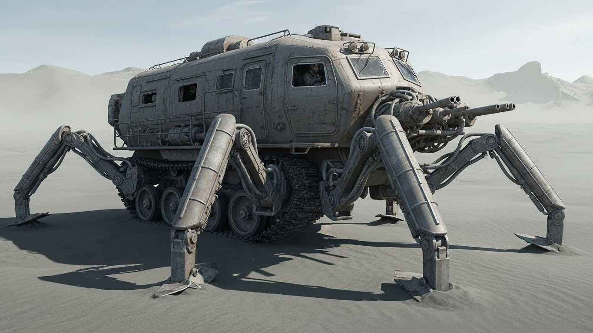

<main class="gender_neutral">
Almost all books have been lost, alongside with civilization. 

The world is now radioactive, in ruins, deserted and covered in grey sand. 

The remains, useless cars and sky-scrapers, tell about a past that don't exist anymore. 

There is little love lost between most of the citizens of the deep buried cities and the Dusters: the ones that cross the desert in large closed tank-like vans, the sand-crawlers. 

Scarce surface goods that no one else can produce are desired, but more and more people seem to think that the outside world should be forgotten - and the duster's runs are waste of resources. 

All Dusters pursue a legend of a machine, the [Untainted Heart](untainted_heart.md), that can make people 
immune to radioactivity. 

That justify the risks of fighting giant animals, and the men-mutants - the [howlers](howlers.md).
</main>

<blockquote class="dynamic_gender">
> ...  you see a group of howlers sprinting ... and then you see 
> `her`. 
> A `woman`. Running off. 
> ... pain hits you like a burden:
> `she` has no suit.  
> ... Weeks of radiation agony before the unavoidable end. 
> You have to do something.  
</blockquote>

