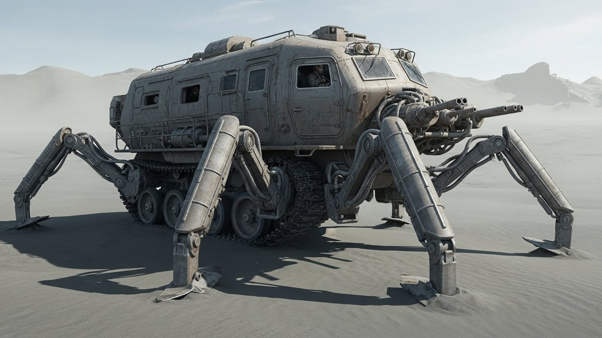

<main class="gender_neutral">
The huge, anti-rad lead doors grind open, and you see once again the familiar, even craved, sight of the surface: an endless desert of grey sand. The always present claustro-agora of being in the Burrows vanishes. 
 
  
The [sandcrawler](sandcrawler.md) starts to move, heavy with the legs still up, useless over sandcrete. The comms startle you: "What's your dest, duster?"  

-The nearby ruins... a teeny run. 

A short silence. "You won't find much there".  

A scoff. -The bastards want glass.  

"Glass???" 

A bitter smile. -Another great scheme from the [Agros](agros.md).  

"It figures. Break a leg". 

Not much to find there, indeed. But strangely, you always liked the view: abandoned, decayed cars and broken store fronts. But what always causes awe, even after a lifetime, are the skyscrapers: their impossibility - the sheer hubris of building so high in a world that can no longer manage to even be on the surface. 

All things of the past. 

You lower the two front legs over the little dune of sand piled above the ground level of the hangar, and the muffled roar of the blowers kicks in. The buoyancy starts to hold as the weight of the crawler's front diminishes.  

"The bastards want glass" drives your thoughts toward the little love lost between most of the citizens and the [dusters](dusters.md). More and more people seem to think that the outside world should be forgotten and the dusters' runs are waste of resources. -But they always want something, don't they? 

As always, you look at the sign dangling at the side of the main panel. "[Untainted Heart](untainted_heart.md)", it reads. -I won't be finding you there, I suppose. 

Then you get disheartened: the rad suit is not on the niche. -Damn it.  

Not much to do without it. As you think about having to return, you suddenly remember: you mindlessly took it off last time and left it hanging inside the airlock. 

Relieved, your thoughts return to the Untainted Heart for the thousandth time. Some say it's a fool's legend. But this is what keeps dusters alive, chasing that dream. It justifies the risks of fighting giant animals, mutants, and the rad itself. Thinking about the [howlers](howlers.md) - the reminder of what radiation can do to men - always makes you shiver. 

-Well, who knows? You may be closer than we think. 
</main>

<blockquote class="dynamic_gender">
... with the scope, you see a group of howlers sprinting - unusual, but not unseen. You start changing the course to
avoid them... and then you see *her*{: .gender_element}. 
A *woman*{: .gender_element}. Running off. 
*She*{: .gender_element} is the cause of the howlers' frenzy. Then something almost like pain
washes through you, starting in your head and falling through your shoulders like a burden:
*she*{: .gender_element} has no suit.  
You almost decide to let the howlers take *her*{: .gender_element}. It would be quick, a mercy 
compared to the weeks of rad agony before the unavoidable end. 
But you cannot force yourself to do it. You have to do something. You ready the sand cannons, adjust the course... to
drive directly into them. 
</blockquote>

[tag]: #sci-fi
[tag]: #scifi
[tag]: #post-apocalyptic
[tag]: #deserted_world
[tag]: #mutants
[tag]: #giant_animals
[tag]: #radiation

